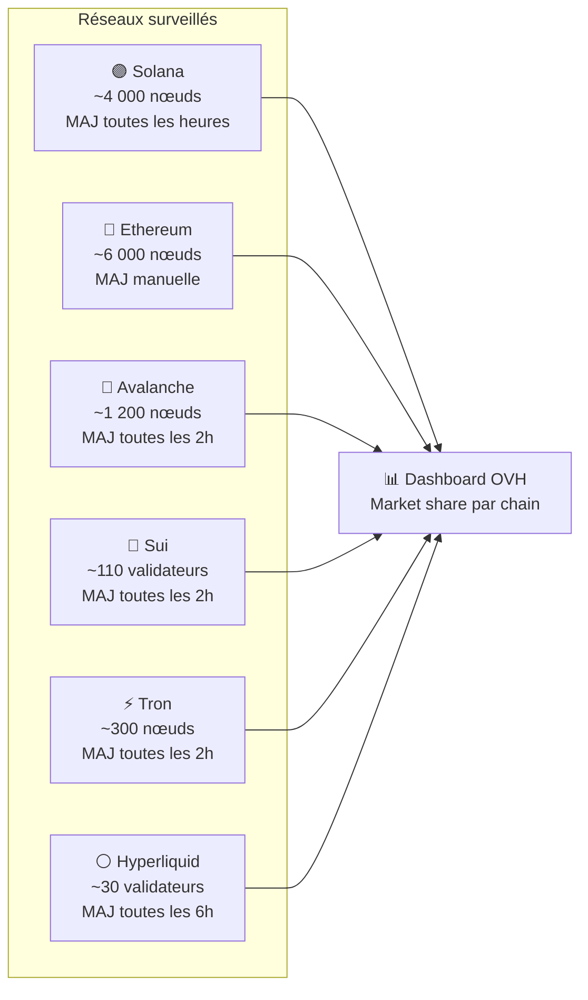
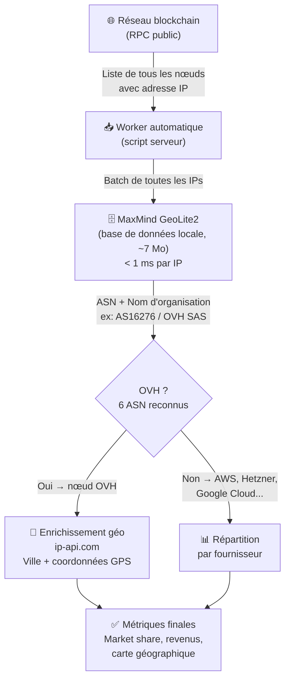
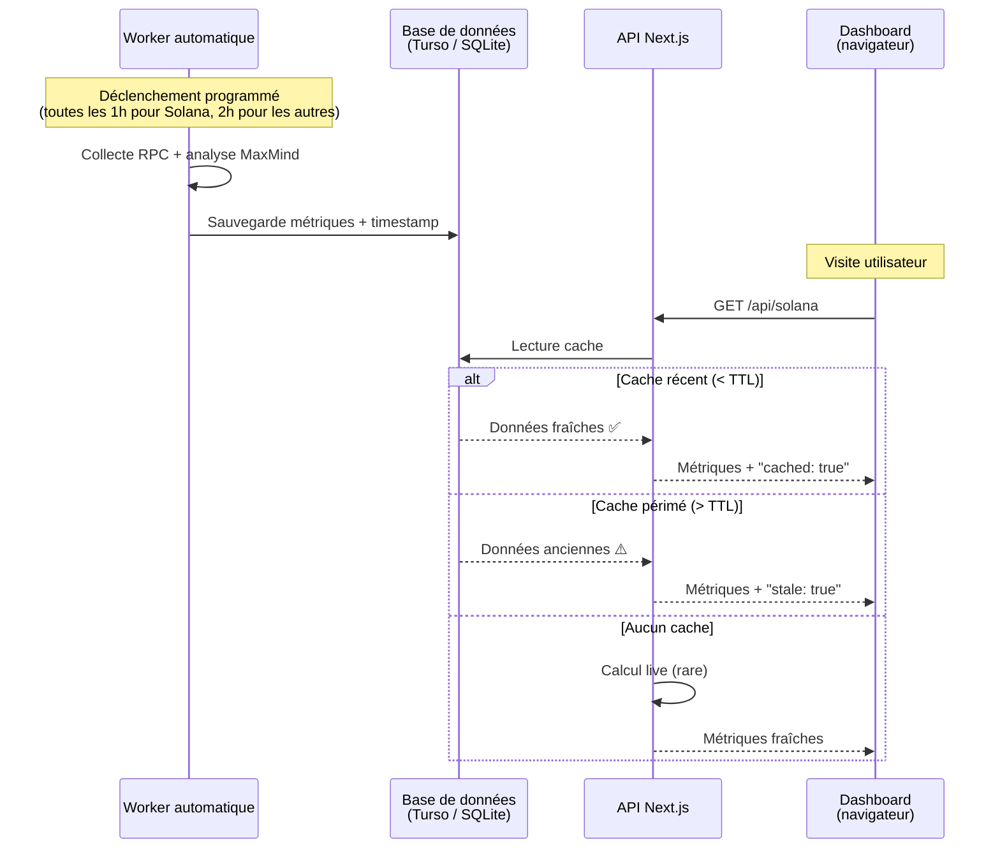
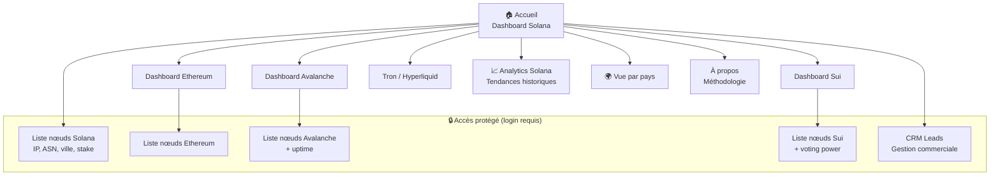
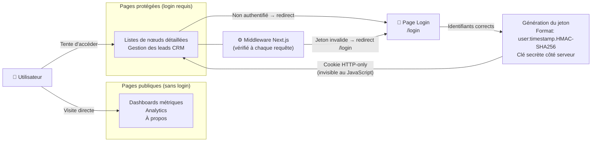

# OVH Blockchain Tracker — Présentation Manager

> Document de référence pour comprendre le dashboard de suivi de la présence OVHcloud sur les réseaux blockchain.
> Rédigé pour un lecteur à l'aise avec la technologie, sans prérequis de développement.

---

## §1 — Ce que le dashboard observe

Le dashboard mesure la **présence d'OVHcloud comme hébergeur d'infrastructure blockchain**. Concrètement : sur les milliers de machines qui font fonctionner un réseau blockchain (nœuds, validateurs), combien tournent sur les serveurs d'OVH ?

Six réseaux blockchain sont couverts, chacun avec ses propres caractéristiques en termes de taille et de fréquence de mise à jour :

Pour chaque réseau, le dashboard affiche : le nombre total de nœuds actifs, le nombre hébergés chez OVH, la part de marché en pourcentage, la répartition géographique et par fournisseur cloud concurrent (AWS, Google Cloud, Hetzner, DigitalOcean, etc.), et pour Solana, une estimation du revenu mensuel généré pour OVH.

---

## §2 — Comment les données arrivent

Chaque blockchain expose publiquement une interface de programmation (RPC) qui permet d'interroger l'état du réseau en temps réel. Le système récupère la liste complète des nœuds actifs, extrait leur adresse IP, puis identifie leur hébergeur à l'aide d'une base de données locale spécialisée.

**Le point clé :** l'identification de l'hébergeur se fait via le numéro ASN (Autonomous System Number), un identifiant réseau mondial unique et infalsifiable attribué à chaque opérateur. OVH possède 6 ASN enregistrés (`AS16276`, `AS35540`, `AS21351`, `AS198203`, `AS50082`, `AS32790`). La base MaxMind est téléchargée localement et consultée sans aucun appel réseau — **moins d'une milliseconde par IP**, soit 4 000 nœuds Solana analysés en moins de 3 secondes.

Pour la géolocalisation précise (ville, coordonnées) uniquement des nœuds OVH détectés (~25 sur Solana), le système appelle le service externe ip-api.com — ce qui représente 25 requêtes au lieu de 4 000, soit **150 fois moins d'appels externes** qu'une approche naïve.

---

## §3 — Fiabilité & fraîcheur des données

Les données ne sont jamais calculées à la volée lors d'une visite du dashboard. Un système de **workers automatiques** tourne en arrière-plan selon un calendrier programmé, calcule les métriques, et les stocke en base de données. Le dashboard se contente de lire ce résultat pré-calculé.

**Stratégie de fallback à 3 niveaux :**
1. **Cache récent** (< TTL) → réponse immédiate, données à jour
2. **Cache périmé** (> TTL) → les données sont affichées avec un avertissement discret ; le dashboard reste fonctionnel même si le worker est en retard
3. **Aucun cache** → calcul à la demande (premier démarrage uniquement)

Cette architecture garantit un **temps de réponse inférieur à 100 ms** pour toutes les visites normales, et une résilience totale aux pannes réseau temporaires.

---

## §4 — Ce que le manager voit

Le dashboard est une application web structurée en pages, une par blockchain, accessibles via un menu latéral. Certaines pages sont publiques (dashboards de métriques), d'autres sont réservées aux accès authentifiés (liste détaillée des nœuds, gestion des leads commerciaux).

**KPIs affichés sur chaque dashboard :**

| Métrique | Solana | Ethereum | Avalanche | Sui |
|---|---|---|---|---|
| Nombre total de nœuds | ✅ | ✅ | ✅ | ✅ |
| Nœuds OVH | ✅ | ✅ | ✅ | ✅ |
| Part de marché OVH (%) | ✅ | ✅ | ✅ | ✅ |
| Revenu mensuel estimé (€) | ✅ | — | — | — |
| Uptime moyen OVH | — | — | ✅ | — |
| Voting power OVH | — | — | — | ✅ |
| Carte géographique | ✅ | ✅ | ✅ | ✅ |
| Répartition fournisseurs | ✅ | ✅ | ✅ | ✅ |

Les visualisations incluent un globe 3D interactif (Three.js), des graphiques de tendance historique (Recharts), et un bouton "Méthodologie" accessible depuis chaque page pour expliquer comment OVH est identifié.

---

## §5 — Sécurité & accès

La sécurité du dashboard repose sur un mécanisme d'authentification développé en interne, sans dépendance à un service tiers (pas d'Auth0, pas de Firebase). Le principe : un jeton d'authentification signé cryptographiquement est stocké dans le navigateur et vérifié à chaque accès aux pages protégées.

**Trois protections superposées :**

1. **HMAC-SHA256** — le jeton est signé avec une clé secrète stockée côté serveur. Il est impossible de le falsifier sans connaître cette clé.
2. **Cookie HTTP-only** — le jeton est inaccessible depuis le JavaScript du navigateur, ce qui bloque les attaques XSS (vol de session par injection de script).
3. **Comparaison à temps constant** — la vérification du jeton utilise une méthode cryptographique résistante aux attaques temporelles (timing attacks), qui exploiteraient des différences de vitesse de comparaison pour deviner la clé.

La vérification se fait au niveau du middleware Next.js — c'est-à-dire **avant** que la page ne soit rendue, ce qui empêche tout accès même partiel aux données protégées.

---

*Document généré le 9 avril 2026 — OVH Blockchain Tracker v1.x*
